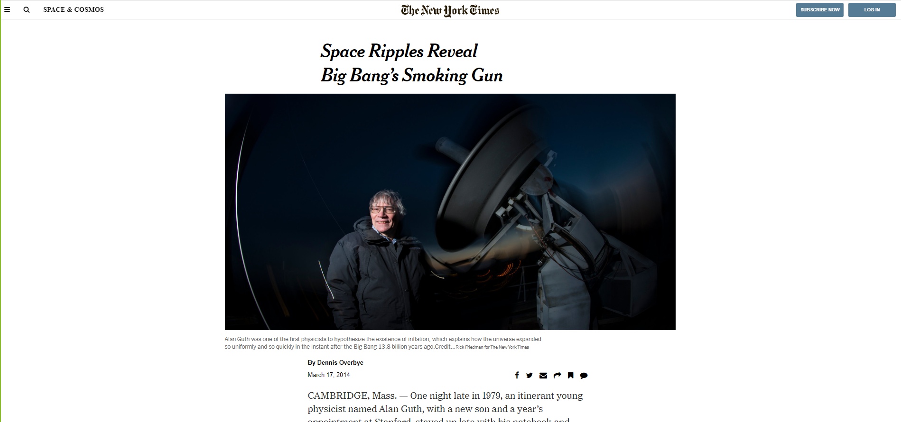

# New York Times Clone
Clone of new york times web page for study purpose

[Original site](https://www.nytimes.com/2014/03/18/science/space/detection-of-waves-in-space-buttresses-landmark-theory-of-big-bang.html?_r=0)

> This is an assigment for Microverse HTML and CSS course. The goal is to clone the New York Times article page with static functionability.

Additional description about the project and its features.

## Built With

- HTML,
- CSS,
- Visual Studio Code

## Live Demo

[Live Demo](https://rawcdn.githack.com/fdfragoso/nyt-clone/ec2f603bd069d19b93a53ec33115122fd32475c1/index.html)

## Getting Started

To get a local copy up and running follow these simple example steps.

### Prerequisites

- A compatible browser with HTML and CSS. 

### Install

- Just clone the project

### Usage

- Open the index.html file in any browser or edit using Visual Code or the preference IDE for web development

## Authors

👤 **Felipe Dacal Fragoso**

- Github: [@fdfragoso](https://github.com/fdfragoso)
- Twitter: [@fdfragoso](https://twitter.com/fdfragoso)
- Linkedin: [@fdfragoso](https://www.linkedin.com/in/fdfragoso/)

👤 **Niiazaly Dzhumaliev**

- Github: [@NiiazalyDzhumaliev](https://github.com/NiiazalyDzhumaliev)
- Twitter: [@Niiazaly1](https://twitter.com/Niiazaly1)
- Linkedin: [@niiazaly-dzhumaliev](https://www.linkedin.com/in/niiazaly-dzhumaliev-117707132/)

## 🤝 Contributing

Contributions, issues and feature requests are welcome!

Feel free to check the [issues page](https://github.com/fdfragoso/nyt-clone/issues).

## Show your support

Give a ⭐️ if you like this project!

## Acknowledgments

- The Odin Project
- The New York Times

## 📝 License

This project is free to use as learning purposes. For any external content (e.g. logo, images, ...), please contact the proper author and check their license of use.
